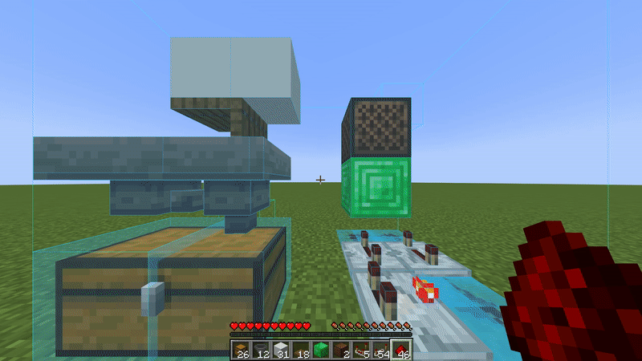

# LitematicaPlacer
This fabric mod can automatically place blocks according to a Litematica schematic. Works both in survival and creative.

This mod can also be used in multiplayer.

## How to use
You can toggle the mod using the toggle key `KP_5` (can be changed in the settings). The mod will then place blocks from your hotbar into their correct positions. The Litematica positions must be within your block reach.
